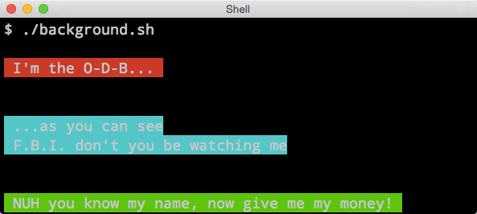

<hr>
<a name="Background"></a>
# Background
To set the background color of any string or object you need to call the `background` method followed by an argument.

### Arguments

#### Colors

Fifteen different colors to choose from:

`black` `red` `green` `yellow` `blue` `magenta` `cyan` `gray`
`white` `darkgray` `lightgreen` `lightyellow` `lightblue`
`lightmagenta` `lightcyan`

#### Termination

Following a string or object you must terminate the `background` method to ensure color doesn't bleed.  You can use any of the following termination arguments:

`end` `off` `reset`

### Code Samples

Here we will demonstrate how the `background` method can be used on a single line.

```bash
echo $(background red "I'm the O-D-B") $(background end)
```
Some times one-line is not enough.

```bash
echo "
$(background grey)
...as you can see
$(background end)
"
```

You can also use `bg` as an alias for `background`

```bash
echo "$(bg green) C.R.E.A.M. $(bg end)"
```

### Results

Here is what the output should look like.  Style may differ slightly depending on your terminal emulator settings.
<center>

</center>
Give it a try, we'll wait here for you.
