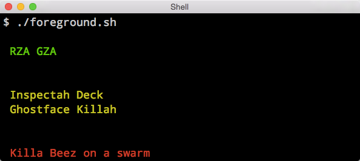

<hr>
<a name="Foreground"></a>
# Foreground

To set the foreground color of any string or object you need to call the `color` method followed by an argument.

### Arguments

#### Colors

Fifteen different colors to choose from:

`black` `red` `green` `yellow` `blue` `magenta` `cyan` `gray`
`white` `darkgray` `lightgreen` `lightyellow` `lightblue`
`lightmagenta` `lightcyan`


#### Termination
Following a string or object you must terminate the `color` method to ensure color doesn't bleed.  You can use any of the following termination arguments:

`end` `off` or `reset`

### Code Samples

Here we will demonstrate how the foreground `color` method can be used on a single line.

```bash
echo $(color green "RZA GZA") $(color end)
```
Some times one-line is not enough.

```bash
echo "
$(color yellow)
Inspectah Deck
Ghostface Killah
$(color end)
"
```

You can also use `c` as an alias for `color`.

```bash
echo $(c red "Killa Beez on a swarm") $(c end)
```

### Results
Here is what the output should look like.  Style may differ slightly depending on your terminal emulator settings.
<center>

</center>
Give it a try, we'll wait here for you.
